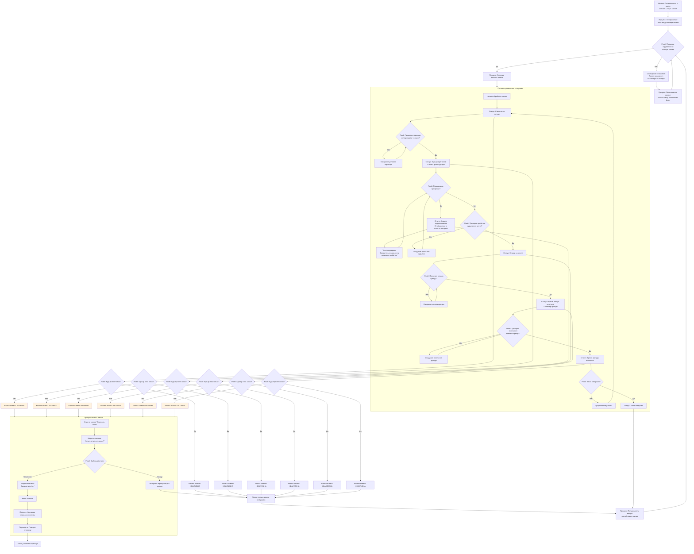

```mermaid
flowchart TD
    A[Начало: Пользователь в шапке<br>кликает 'Статус заказа'] --> B[Процесс: Отображение<br>поля ввода номера заказа]
    B --> C{Ромб: Проверка корректности<br>номера заказа}
    
    C -- Нет --> D[Сообщение об ошибке:<br>'Такого заказа нет.<br>Точно верный номер?']
    D --> E[Процесс: Пользователь вводит<br>новый номер и нажимает Enter]
    E --> C

    C -- Да --> F[Процесс: Загрузка данных заказа]
    F --> STATUS_SYSTEM

    subgraph STATUS_SYSTEM[Система управления статусами]
        direction TB
        START_STATUS[Начало обработки заказа] --> S1
        
        S1[Статус: Самокат на складе] --> C1{Ромб: Проверка перехода<br>к следующему статусу?}
        C1 -- Нет --> W1[Ожидание условия перехода] --> C1
        C1 -- Да --> S2
        
        S2[Статус: Курьер едет к вам<br>+ Имя и фото курьера] --> C2{Ромб: Проверка на просрочку?}
        C2 -- Да --> S2_DELAYED
        S2_DELAYED[Статус: Курьер задерживается<br>Отображение в КРАСНОМ цвете] --> SUPPORT[Текст поддержки:<br>'Свяжитесь с нами, если<br>курьер не найдётся'] --> C2
        C2 -- Нет --> C3{Ромб: Проверка прибытия<br>курьера на место?}
        C3 -- Нет --> W2[Ожидание прибытия курьера] --> C2
        C3 -- Да --> S3
        
        S3[Статус: Курьер на месте] --> C4{Ромб: Проверка начала<br>аренды?}
        C4 -- Нет --> W3[Ожидание начала аренды] --> C4
        C4 -- Да --> S4
        
        S4[Статус: Ну всё, теперь кататься!<br>+ Таймер аренды] --> C5{Ромб: Проверка окончания<br>времени аренды?}
        C5 -- Нет --> W4[Ожидание окончания аренды] --> C5
        C5 -- Да --> S5
        
        S5[Статус: Время аренды кончилось] --> FINAL{Ромб: Заказ завершён?}
        FINAL -- Нет --> STATUS_CYCLE[Продолжение работы] --> S1
        FINAL -- Да --> COMPLETED[Статус: Заказ завершён]
    end

    %% Связи статусов с системой отмены
    S1 --> CANCEL1
    S2 --> CANCEL2
    S2_DELAYED --> CANCEL3
    S3 --> CANCEL4
    S4 --> CANCEL5
    S5 --> CANCEL6

    %% Блоки проверки отмены
    CANCEL1{Ромб: Курьер взял заказ?} -- Нет --> ACTIVE1[Кнопка отмены АКТИВНА]
    CANCEL1 -- Да --> INACTIVE1[Кнопка отмены НЕАКТИВНА]
    
    CANCEL2{Ромб: Курьер взял заказ?} -- Нет --> ACTIVE2[Кнопка отмены АКТИВНА]
    CANCEL2 -- Да --> INACTIVE2[Кнопка отмены НЕАКТИВНА]
    
    CANCEL3{Ромб: Курьер взял заказ?} -- Нет --> ACTIVE3[Кнопка отмены АКТИВНА]
    CANCEL3 -- Да --> INACTIVE3[Кнопка отмены НЕАКТИВНА]
    
    CANCEL4{Ромб: Курьер взял заказ?} -- Нет --> ACTIVE4[Кнопка отмены АКТИВНА]
    CANCEL4 -- Да --> INACTIVE4[Кнопка отмены НЕАКТИВНА]
    
    CANCEL5{Ромб: Курьер взял заказ?} -- Нет --> ACTIVE5[Кнопка отмены АКТИВНА]
    CANCEL5 -- Да --> INACTIVE5[Кнопка отмены НЕАКТИВНА]
    
    CANCEL6{Ромб: Курьер взял заказ?} -- Нет --> ACTIVE6[Кнопка отмены АКТИВНА]
    CANCEL6 -- Да --> INACTIVE6[Кнопка отмены НЕАКТИВНА]

    %% Связи активных кнопок с процессом отмены
    ACTIVE1 --> CANCEL_PROCESS
    ACTIVE2 --> CANCEL_PROCESS
    ACTIVE3 --> CANCEL_PROCESS
    ACTIVE4 --> CANCEL_PROCESS
    ACTIVE5 --> CANCEL_PROCESS
    ACTIVE6 --> CANCEL_PROCESS

    %% Связи неактивных кнопок с отображением
    INACTIVE1 --> DISPLAY
    INACTIVE2 --> DISPLAY
    INACTIVE3 --> DISPLAY
    INACTIVE4 --> DISPLAY
    INACTIVE5 --> DISPLAY
    INACTIVE6 --> DISPLAY

    %% Процесс отмены заказа
    subgraph CANCEL_PROCESS[Процесс отмены заказа]
        direction TB
        CP1[Клик по кнопке 'Отменить заказ'] --> CP2[Модальное окно:<br>'Хотите отменить заказ?']
        CP2 --> CP3{Ромб: Выбор действия}
        CP3 -- 'Назад' --> CP4[Возврат к экрану статуса заказа]
        CP3 -- 'Отменить' --> CP5[Модальное окно:<br>'Заказ отменён...']
        CP5 --> CP6[Клик 'Хорошо'] 
        CP6 --> CP7[Процесс: Удаление заказа из системы] 
        CP7 --> CP8[Переход на Главную страницу]
    end

    CP4 --> DISPLAY[Экран статуса заказа отображён]
    CP8 --> AA[Конец: Главная страница]

    DISPLAY --> NEW_ORDER[Процесс: Пользователь вводит<br>другой номер заказа]
    COMPLETED --> NEW_ORDER
    NEW_ORDER --> C

    classDef red fill:
    class S2_DELAYED red
    classDef status fill:
    class S1,S2,S3,S4,S5,S2_DELAYED,COMPLETED status
    classDef cancel fill:#fff3e0
    class ACTIVE1,ACTIVE2,ACTIVE3,ACTIVE4,ACTIVE5,ACTIVE6 cancel
```
