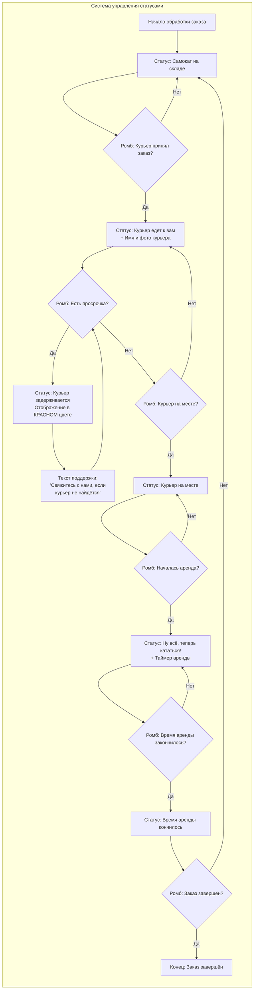

```mermaid
flowchart TD
    subgraph STATUS_SYSTEM[Система управления статусами]
        direction TB
        START_STATUS[Начало обработки заказа] --> S1
        
        S1[Статус: Самокат на складе] --> C1{Ромб: Курьер принял заказ?}
        C1 -- Нет --> S1
        C1 -- Да --> S2
        
        S2[Статус: Курьер едет к вам<br>+ Имя и фото курьера] --> C2{Ромб: Есть просрочка?}
        C2 -- Да --> S2_DELAYED
        S2_DELAYED[Статус: Курьер задерживается<br>Отображение в КРАСНОМ цвете] --> SUPPORT[Текст поддержки:<br>'Свяжитесь с нами, если<br>курьер не найдётся'] --> C2
        C2 -- Нет --> C3{Ромб: Курьер на месте?}
        C3 -- Нет --> S2
        C3 -- Да --> S3
        
        S3[Статус: Курьер на месте] --> C4{Ромб: Началась аренда?}
        C4 -- Нет --> S3
        C4 -- Да --> S4
        
        S4[Статус: Ну всё, теперь кататься!<br>+ Таймер аренды] --> C5{Ромб: Время аренды закончилось?}
        C5 -- Нет --> S4
        C5 -- Да --> S5
        
        S5[Статус: Время аренды кончилось] --> FINAL{Ромб: Заказ завершён?}
        FINAL -- Нет --> S1
        FINAL -- Да --> END[Конец: Заказ завершён]
    end
```
