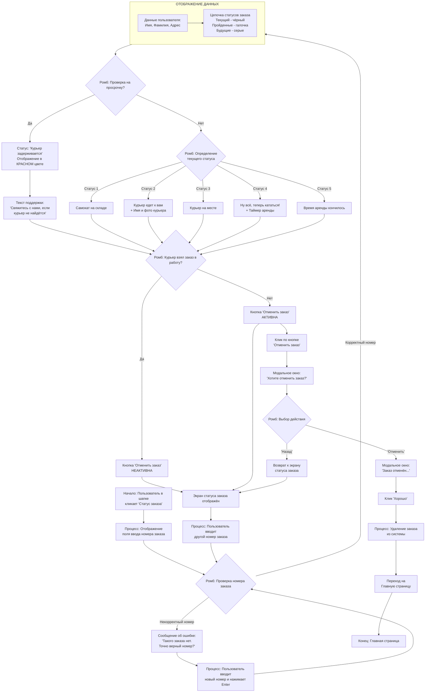

```mermaid
flowchart TD
    A[Начало: Пользователь в шапке<br>кликает 'Статус заказа'] --> B[Процесс: Отображение<br>поля ввода номера заказа]
    B --> C{Ромб: Проверка номера заказа}
    
    C -- Некорректный номер --> D[Сообщение об ошибке:<br>'Такого заказа нет.<br>Точно верный номер?']
    D --> E[Процесс: Пользователь вводит<br>новый номер и нажимает Enter]
    E --> C

    C -- Корректный номер --> F
    subgraph F [ОТОБРАЖЕНИЕ ДАННЫХ]
        F1[Данные пользователя:<br>Имя, Фамилия, Адрес] --> F2[Цепочка статусов заказа<br>Текущий - чёрный<br>Пройденные - галочка<br>Будущие - серые]
    end

    F --> G{Ромб: Проверка на просрочку?}
    
    %% ВЕТКА ПРОСРОЧКИ
    G -- Да --> H[Статус: 'Курьер задерживается'<br>Отображение в КРАСНОМ цвете]
    H --> I[Текст поддержки:<br>'Свяжитесь с нами, если<br>курьер не найдётся']
    I --> P

    G -- Нет --> J{Ромб: Определение<br>текущего статуса}
    
    %% ОСНОВНЫЕ СТАТУСЫ
    J -- Статус 1 --> K[Самокат на складе]
    J -- Статус 2 --> L[Курьер едет к вам<br>+ Имя и фото курьера]
    J -- Статус 3 --> M[Курьер на месте]
    J -- Статус 4 --> N[Ну всё, теперь кататься!<br>+ Таймер аренды]
    J -- Статус 5 --> O[Время аренды кончилось]

    K --> P
    L --> P  
    M --> P
    N --> P
    O --> P

    P{Ромб: Курьер взял заказ в работу?} -- Нет --> Q[Кнопка 'Отменить заказ'<br>АКТИВНА]
    P -- Да --> R[Кнопка 'Отменить заказ'<br>НЕАКТИВНА]

    R --> Z[Экран статуса заказа отображён]
    Q --> Z
    
    %% ПОДПРОЦЕСС ОТМЕНЫ ЗАКАЗА
    Q --> U1[Клик по кнопке<br>'Отменить заказ']
    U1 --> U2[Модальное окно:<br>'Хотите отменить заказ?']
    U2 --> U3{Ромб: Выбор действия}
    U3 -- 'Назад' --> U4[Возврат к экрану<br>статуса заказа]
    U3 -- 'Отменить' --> U5[Модальное окно:<br>'Заказ отменён...']
    U5 --> U6[Клик 'Хорошо'] 
    U6 --> U7[Процесс: Удаление заказа<br>из системы] 
    U7 --> U8[Переход на<br>Главную страницу]

    U4 --> Z
    U8 --> AA[Конец: Главная страница]

    Z --> CC[Процесс: Пользователь вводит<br>другой номер заказа]
    CC --> C

    classDef red fill:
    class H red
```
