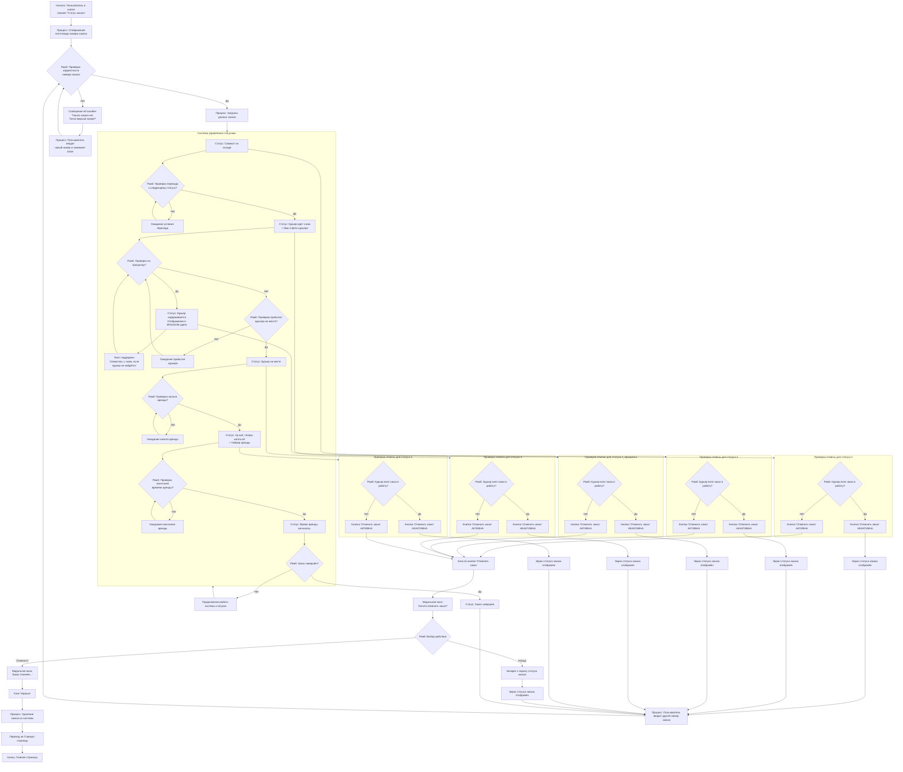

```mermaid
flowchart TD
    A[Начало: Пользователь в шапке<br>кликает 'Статус заказа'] --> B[Процесс: Отображение<br>поля ввода номера заказа]
    B --> C{Ромб: Проверка корректности<br>номера заказа}
    
    C -- Нет --> D[Сообщение об ошибке:<br>'Такого заказа нет.<br>Точно верный номер?']
    D --> E[Процесс: Пользователь вводит<br>новый номер и нажимает Enter]
    E --> C

    C -- Да --> F[Процесс: Загрузка данных заказа]
    F --> STATUS_SYSTEM

    subgraph STATUS_SYSTEM[Система управления статусами]
        S1[Статус: Самокат на складе] --> C1{Ромб: Проверка перехода<br>к следующему статусу?}
        C1 -- Нет --> W1[Ожидание условия перехода] --> C1
        C1 -- Да --> S2[Статус: Курьер едет к вам<br>+ Имя и фото курьера]
        
        S2 --> C2{Ромб: Проверка на просрочку?}
        C2 -- Да --> S2_DELAYED[Статус: Курьер задерживается<br>Отображение в КРАСНОМ цвете]
        S2_DELAYED --> SUPPORT[Текст поддержки:<br>'Свяжитесь с нами, если<br>курьер не найдётся']
        SUPPORT --> C2
        C2 -- Нет --> C3{Ромб: Проверка прибытия<br>курьера на место?}
        
        C3 -- Нет --> W2[Ожидание прибытия курьера] --> C2
        C3 -- Да --> S3[Статус: Курьер на месте]
        
        S3 --> C4{Ромб: Проверка начала<br>аренды?}
        C4 -- Нет --> W3[Ожидание начала аренды] --> C4
        C4 -- Да --> S4[Статус: Ну всё, теперь кататься!<br>+ Таймер аренды]
        
        S4 --> C5{Ромб: Проверка окончания<br>времени аренды?}
        C5 -- Нет --> W4[Ожидание окончания аренды] --> C5
        C5 -- Да --> S5[Статус: Время аренды кончилось]
        
        S5 --> FINAL{Ромб: Заказ завершён?}
    end

    S1 --> CANCEL_CHECK1
    S2 --> CANCEL_CHECK2
    S2_DELAYED --> CANCEL_CHECK3
    S3 --> CANCEL_CHECK4
    S4 --> CANCEL_CHECK5
    
    subgraph CANCEL_CHECK1[Проверка отмены для статуса 1]
        CC1{Ромб: Курьер взял заказ в работу?} -- Нет --> A1[Кнопка 'Отменить заказ' АКТИВНА]
        CC1 -- Да --> NA1[Кнопка 'Отменить заказ' НЕАКТИВНА]
    end
    
    subgraph CANCEL_CHECK2[Проверка отмены для статуса 2]
        CC2{Ромб: Курьер взял заказ в работу?} -- Нет --> A2[Кнопка 'Отменить заказ' АКТИВНА]
        CC2 -- Да --> NA2[Кнопка 'Отменить заказ' НЕАКТИВНА]
    end
    
    subgraph CANCEL_CHECK3[Проверка отмены для статуса 2_просрочка]
        CC3{Ромб: Курьер взял заказ в работу?} -- Нет --> A3[Кнопка 'Отменить заказ' АКТИВНА]
        CC3 -- Да --> NA3[Кнопка 'Отменить заказ' НЕАКТИВНА]
    end
    
    subgraph CANCEL_CHECK4[Проверка отмены для статуса 3]
        CC4{Ромб: Курьер взял заказ в работу?} -- Нет --> A4[Кнопка 'Отменить заказ' АКТИВНА]
        CC4 -- Да --> NA4[Кнопка 'Отменить заказ' НЕАКТИВНА]
    end
    
    subgraph CANCEL_CHECK5[Проверка отмены для статуса 4]
        CC5{Ромб: Курьер взял заказ в работу?} -- Нет --> A5[Кнопка 'Отменить заказ' АКТИВНА]
        CC5 -- Да --> NA5[Кнопка 'Отменить заказ' НЕАКТИВНА]
    end

    A1 --> U1[Клик по кнопке 'Отменить заказ']
    A2 --> U1
    A3 --> U1
    A4 --> U1
    A5 --> U1
    
    NA1 --> DISPLAY1[Экран статуса заказа отображён]
    NA2 --> DISPLAY2[Экран статуса заказа отображён]
    NA3 --> DISPLAY3[Экран статуса заказа отображён]
    NA4 --> DISPLAY4[Экран статуса заказа отображён]
    NA5 --> DISPLAY5[Экран статуса заказа отображён]

    U1 --> U2[Модальное окно:<br>'Хотите отменить заказ?']
    U2 --> U3{Ромб: Выбор действия}
    U3 -- 'Назад' --> U4[Возврат к экрану статуса заказа]
    U3 -- 'Отменить' --> U5[Модальное окно:<br>'Заказ отменён...']
    U5 --> U6[Клик 'Хорошо'] 
    U6 --> U7[Процесс: Удаление заказа из системы] 
    U7 --> U8[Переход на Главную страницу]

    U4 --> DISPLAY_RETURN[Экран статуса заказа отображён]
    U8 --> AA[Конец: Главная страница]

    DISPLAY1 --> NEW_ORDER[Процесс: Пользователь вводит другой номер заказа]
    DISPLAY2 --> NEW_ORDER
    DISPLAY3 --> NEW_ORDER
    DISPLAY4 --> NEW_ORDER
    DISPLAY5 --> NEW_ORDER
    DISPLAY_RETURN --> NEW_ORDER
    
    NEW_ORDER --> C

    FINAL -- Нет --> STATUS_CYCLE[Продолжение работы системы статусов]
    FINAL -- Да --> COMPLETED[Статус: Заказ завершён]
    COMPLETED --> NEW_ORDER

    STATUS_CYCLE --> STATUS_SYSTEM

    classDef red fill:
    class S2_DELAYED red
```
